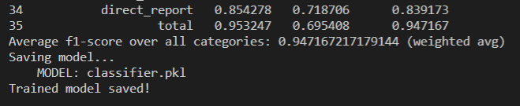
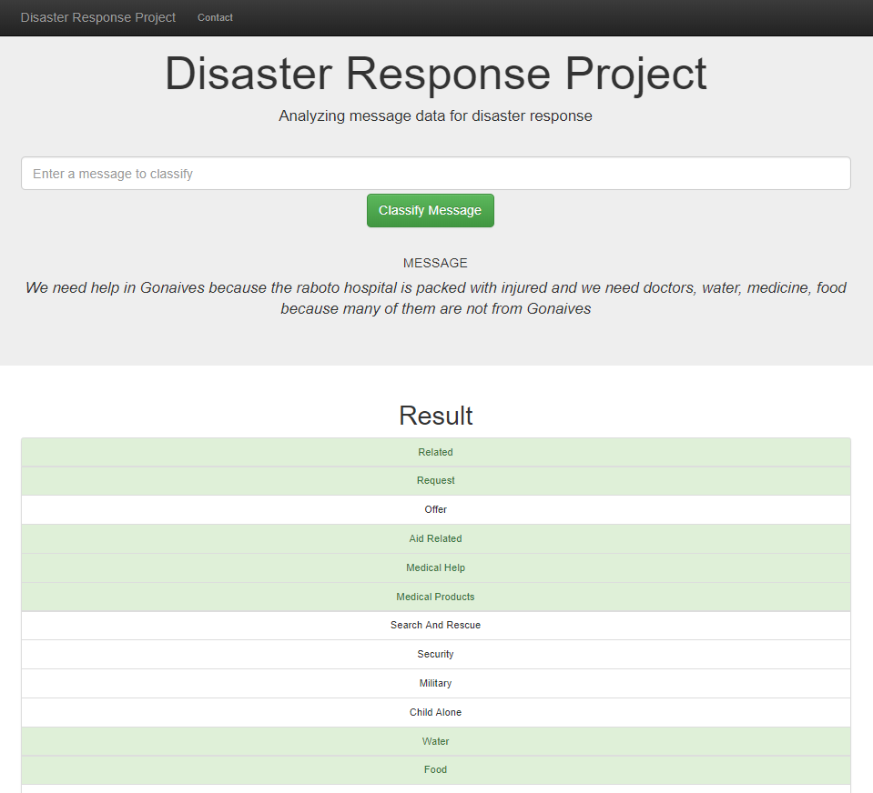

## Disaster Response Project
Dashboard for classification of messages sent during disaster

---

* [Project Description](#project-description) 
  * [Overview](#overview)
  * [Main parts](#main-parts)
  * [Algorithms & Performance](#algorithms-&-performance)
  * [Future improvements](#future-improvements)
* [Getting started](#getting-started)
  * [Installing Requirements](#installing-requirements)
  * [Execute tests](#execute-tests)
  * [Cleaning data](#cleaning-data)
  * [Training model](#training-model)
  * [Starting dashboard](#starting-the-dashboard)
* [Authors](#authors)   
* [License](#license)   
* [Screenshots](#screenshots)
* [Acknowledgements](#acknowledgements)
  
---

### Project Description

#### Overview
The target of this project is to classify messages sent during and after a disaster. With a correct classification of the messages the different disaster response organizations are able to provide much more efficient and effective help for the people that need it. 


This project is part of the Data Science Nanodegree [@Udacity](https://www.udacity.com) and is done in collaboration with [FigureEight](https://www.figure-eight.com/).

#### Main parts
There are three main parts of the project:

1. **ETL Pipeline** - takes the messages.csv and categories.csv as input and produces combined sqlite table.
2. **ML Pipeline** - trains and evaluates the model and produces a pickle file from the trained model. This model is then used from the dashboard.
3. **Dashboard** - shows some statistics about the training data and allows the user to input and classify a message.

#### Algorithms & Performance

##### Natural language processing

After the intial cleaning of the data the following classes were used to prepare the data for classification:

* [CountVectorizer](https://scikit-learn.org/stable/modules/generated/sklearn.feature_extraction.text.CountVectorizer.html)
* [TfidfTransformer](https://scikit-learn.org/stable/modules/generated/sklearn.feature_extraction.text.TfidfTransformer.html)
* [StartingVerbExtractor](models/feature_extractor.py)
* [ResonseLengthExtractor](models/feature_extractor.py)

##### Classification

The classification of the input vectors was done individually per category by using a [MultiOutputClassifier](https://scikit-learn.org/stable/modules/generated/sklearn.multioutput.MultiOutputClassifier.html) combined with an [AdaBoostClassifier](https://scikit-learn.org/stable/modules/generated/sklearn.ensemble.AdaBoostClassifier.html) (which yielded slightly better results than a RandomForestClassifier)

##### Evaluation

Because of the unbalanced distributions a average f1-score (weighted average) over all the categories has been used. With a test size of 2% (as suggested in the task-position) a score of *94.7%* has been achieved.

#### Future improvements
Entering the messages manually suits demonstrations purposes but will not fit the demands of disaster response professionals. To make the project suitable for production we would need to build a more sophisticated API or a Microservice.

---

### Getting started

To use the dashboard you first need to clean the data. After cleaning the data you can train the model and export it for the web application.

#### Installing Requirements

The following packages need to be installed for the project:

* numpy, pandas
* scikit-learn
* nltk
* sqlalchemy, pickle
* flask, plotly, json
* pytest

#### Cleaning data

To run the etl pipeline you can execute the following command in the data folder:
````
python process_data.py messages.csv categories.csv DisasterResponse.db
````

#### Training the model

To train and serialize the model you can execute the following command:
````
python models/train_classifier.py data/DisasterResponses.db classifier.pkl
````

#### Starting the Dashboard

To start the web app you can execute this line in the root directory:
````
python run.py
````

#### Execute tests
The feature extraction is hardened with some tests. You can execute all tests by executing the following line in the root directory:
````
pytest
````
---

### Authors

* [Christoph Hilty](https://www.github.com/huli)

---
### License
[](https://opensource.org/licenses/MIT)

---
### Screenshots

#### Output of ML Pipeline


#### Dashboard for classification of messages



---
### Acknowledgements
* [Udacity](https://www.udacity.com) - for the project basis and the teaching
* [FigureEight](https://www.figure-eight.com/) - for providing us with real world data from actual disasters

--